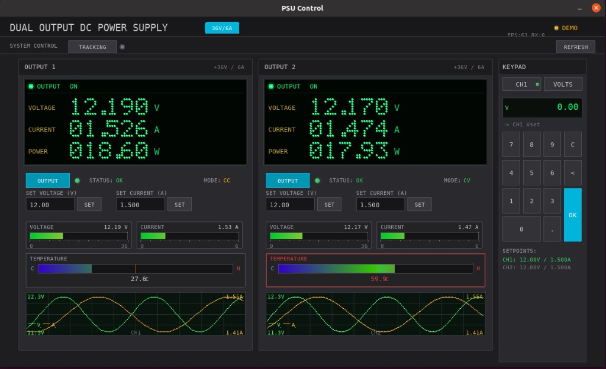

# Open LabBench

A model-agnostic bench-instrument control app in C/SDL2. One binary, one
launcher, **six** UI layouts (four for PSUs, two for DMMs), and a growing set
of drivers across two instrument classes:

- **PSUs** — Modbus-bridge boards (Riden / DPS-style via ESP32), SCPI
  supplies (Siglent SPD, Keysight/Agilent/HP E36xxA + classic 663xA, Rigol
  DP800 family, Rohde & Schwarz HMP / NGE, Keithley 2230G / 2231A),
  Korad-protocol bench supplies (Korad / TENMA / Velleman / Hanmatek and
  clones), plus a synthetic demo driver.
- **DMMs** — OWON XDM-series over USB-serial, classic & Truevolt Keysight/
  Agilent/HP (34401A, 34461A, 34465A, 34470A), Fluke 884x in 34401A-compat
  SCPI mode, Keithley 2000 & DMM6500. The Keysight/Fluke/Keithley drivers
  all reach the instrument via either USB-serial **or** a Prologix
  GPIB-USB-HPIB adapter (`--port=prologix:/dev/ttyUSB0:<gpib-addr>`).
  Plus a synthetic demo DMM.

The launcher knows the instrument kind: selecting a PSU driver enables the
PSU views (toolbar-single, toolbar-dual, full-single, full-dual); selecting
a DMM driver enables the DMM views (dmm-toolbar, dmm-full). Each LAUNCH
fork/execs `psu_app` so several windows can run side-by-side, each with its
own driver+view combination.

Each PSU model is a *driver* and each UI layout is a *view*. Any view runs
against any driver, and you can launch several `psu_app` windows side by side
each on a different combination (e.g. one window driving a Modbus bridge in
the full GUI, another driving a Siglent over GPIB in the toolbar).

See [ARCHITECTURE.md](ARCHITECTURE.md) for the driver/view layering and the
port-spec grammar.

## Screenshots

Images live in [`screenshots/`](screenshots/).

### Full GUI — dual channel  (`--view=full-dual`)

Two **OUTPUT** panels (CH1 / CH2), shared keypad, **SYSTEM CONTROL** toolbar
with **TRACKING**.



### Full GUI — single channel  (`--view=full-single`)

Compact window: one **OUTPUT 1** panel, **CONTROL** toolbar (no tracking),
collapsible keypad (**`<`** on the keypad bar to hide, **`>`** strip to show
again).


### Toolbar — dual channel  (`--view=toolbar-dual`)

Minimal strip: **CH1** and **CH2** side by side, large V/A readouts, **SET**
popup for setpoints, **OUT** per channel.


### Toolbar — single channel  (`--view=toolbar-single`)

Same UX as the dual toolbar but a single row driving channel 1 on the wire.

### DMM toolbar  (`--view=dmm-toolbar`)

Compact strip: mode label (DCV / ACV / Ω / …), big primary reading scaled
to engineering units (mV / µA / kΩ / …), AUTO badge when auto-ranging, OL
on overload, rate label. Read-only — mode and range are changed on the
meter front panel or via the full DMM view.

### DMM full  (`--view=dmm-full`)

Bigger window with a large primary readout, mode/range/rate buttons, a
running min/max/avg, and a recent-trace scope strip. Mode buttons are
greyed out for modes the driver doesn't expose.

---

## Drivers

| `--driver=`       | Hardware                                                                          | Transport                                 |
| ----------------- | --------------------------------------------------------------------------------- | ----------------------------------------- |
| `modbus-bridge`   | Riden RD60xx / DPS-style PSU fronted by ESP32 firmware                            | USB serial (text Modbus bridge)           |
| `siglent-spd`     | Siglent SPD3303C / X (and SPD-series), incl. series-tracking via SCPI             | SCPI over USB-serial **or** Prologix GPIB |
| `keysight-e3631a` | Keysight/Agilent/HP E3631A (triple output +6V/+25V/-25V)                          | SCPI over USB-serial **or** Prologix GPIB |
| `keysight-e3633a` | Keysight/Agilent/HP E3633A (single 8V/20A or 20V/10A)                             | SCPI over USB-serial **or** Prologix GPIB |
| `keysight-e3634a` | Keysight/Agilent/HP E3634A (single 8V/7A or 25V/4A)                               | SCPI over USB-serial **or** Prologix GPIB |
| `keysight-e3645a` | Keysight/Agilent/HP E3645A (single 8V/5A or 20V/2.2A)                             | SCPI over USB-serial **or** Prologix GPIB |
| `rigol-dp832`     | Rigol DP832 (CH1+CH2 30V/3A, CH3 5V/3A)                                           | SCPI over USB-serial **or** Prologix GPIB |
| `rigol-dp832a`    | Rigol DP832A (higher-resolution variant of DP832)                                 | SCPI over USB-serial **or** Prologix GPIB |
| `rigol-dp811`     | Rigol DP811 single output, 20V/10A (or 40V/5A low-current)                        | SCPI over USB-serial **or** Prologix GPIB |
| `rigol-dp711`     | Rigol DP711 single output, 30V/5A linear                                          | SCPI over USB-serial **or** Prologix GPIB |
| `rs-hmp4040`      | Rohde & Schwarz HMP4040, quad output 32V/10A                                      | SCPI over USB-serial **or** Prologix GPIB |
| `rs-hmp4030`      | Rohde & Schwarz HMP4030, triple output 32V/10A                                    | SCPI over USB-serial **or** Prologix GPIB |
| `rs-hmp2030`      | Rohde & Schwarz HMP2030, triple output 32V/5A                                     | SCPI over USB-serial **or** Prologix GPIB |
| `rs-nge103b`      | Rohde & Schwarz NGE103B, triple output 32V/3A                                     | SCPI over USB-serial **or** Prologix GPIB |
| `keithley-2230g`  | Keithley/Tek 2230G triple output (30V/1.5A x2 + 6V/5A)                            | SCPI over USB-serial **or** Prologix GPIB |
| `keithley-2231a`  | Keithley/Tek 2231A-30-3 triple output 30V/3A                                      | SCPI over USB-serial **or** Prologix GPIB |
| `hp-6632a`        | Classic HP/Agilent 6632A single output 20V/5A                                     | SCPI over USB-serial **or** Prologix GPIB |
| `hp-6633a`        | Classic HP/Agilent 6633A single output 50V/2A                                     | SCPI over USB-serial **or** Prologix GPIB |
| `hp-6634a`        | Classic HP/Agilent 6634A single output 100V/1A                                    | SCPI over USB-serial **or** Prologix GPIB |
| `korad-ka`        | Korad KA-protocol — Korad / TENMA / Velleman / Hanmatek / RND clones              | USB serial (no-terminator text)           |
| `demo`            | Synthetic 2-channel PSU — animated values, no hardware required                   | none                                      |

### DMM drivers

| `--driver=`         | Hardware                                                                                 | Transport                                 |
| ------------------- | ---------------------------------------------------------------------------------------- | ----------------------------------------- |
| `owon-xdm`          | OWON XDM-series bench DMM — XDM1041 / XDM1241 / XDM2041 (+ XDM3000 family if compatible) | SCPI over USB serial                      |
| `keysight-34401a`   | Classic Keysight/Agilent/HP 34401A — 6½-digit                                            | SCPI over USB-serial **or** Prologix GPIB |
| `keysight-34461a`   | Keysight Truevolt 34461A — 6½-digit entry                                                | SCPI over USB-serial **or** Prologix GPIB |
| `keysight-34465a`   | Keysight Truevolt 34465A — 6½-digit mid                                                  | SCPI over USB-serial **or** Prologix GPIB |
| `keysight-34470a`   | Keysight Truevolt 34470A — 7½-digit                                                      | SCPI over USB-serial **or** Prologix GPIB |
| `fluke-8845a`       | Fluke 8845A — 6½-digit (default 34401A-compat SCPI mode)                                 | SCPI over USB-serial **or** Prologix GPIB |
| `fluke-8846a`       | Fluke 8846A — 6½-digit with 4-wire ohms                                                  | SCPI over USB-serial **or** Prologix GPIB |
| `keithley-2000`     | Keithley 2000 — legacy 6½-digit; typically GPIB                                          | SCPI over USB-serial **or** Prologix GPIB |
| `keithley-dmm6500`  | Keithley DMM6500 Touch — auto-switches to SCPI mode on open                              | SCPI over USB-serial **or** Prologix GPIB |
| `dmm-demo`          | Synthetic 6½-digit DMM — animated reading, no hardware                                   | none                                      |

Run `./psu_app --list` to see this list with descriptions and defaults.

Adding another SCPI instrument is a one-profile-entry change in
[`src/drivers/scpi_psu/scpi_psu.c`](src/drivers/scpi_psu/scpi_psu.c); adding
a fully new wire protocol is a sibling folder under `src/drivers/` plus one
line in `src/drivers/registry.c` — see [ARCHITECTURE.md](ARCHITECTURE.md).

## Port-spec grammar (SCPI drivers)

```text
serial:/dev/ttyUSB0                # direct USB-serial (default baud)
serial:/dev/ttyUSB0:9600           # with explicit baud override
prologix:/dev/ttyUSB0:5            # Prologix GPIB-USB-HPIB controller, GPIB addr 5
prologix:/dev/ttyUSB0:5:115200     # with explicit Prologix-port baud
/dev/ttyUSB0                       # shorthand → serial:/dev/ttyUSB0
```

Non-SCPI drivers (modbus-bridge, korad-ka) just take the bare device path.

---

## Binaries

| Binary | Role |
| ------ | ---- |
| `psu_app` | Main app. No args → launcher; with `--driver`/`--view` → runs that combination directly (this is what the launcher fork/execs for each new window). |
| `psu_probe` | Non-SDL CLI for sanity-checking a driver without launching the GUI. |
| `psu_gui` / `psu_gui_single` / `psu_gui_toolbar` / `psu_gui_toolbar_single` | Legacy stand-alone GUIs under [`legacy/`](legacy/). Kept building during the refactor so a known-good reference is always available; retired once the matching view runs cleanly inside `psu_app`. |

---

## Features

### Full GUI

- **VFD display** — voltage, current, power with green-on-black style
- **Bar meters** — voltage and current vs full-scale (read from driver caps)
- **Temperature** — gradient bar with warning behavior
- **Scope traces** — voltage (green) and current (yellow) on one timebase
- **OUTPUT** toggle, **SET VOLTAGE / SET CURRENT** fields and buttons
- **Keypad** — numeric entry for setpoints (dual: CH1/CH2 toggle; single: CH1 only, collapsible panel)
- **TRACKING** (dual only) — driver-side `set_tracking()`

### Toolbar GUI

- Large **V** and **A** readouts, **ON/OFF**, **CV/CC**, **ERR** when invalid
- **OUT** toggles output; **SET** opens a modal for V/A setpoints (**APPLY**, **CANCEL**, click outside, **Esc**)
- Window height grows while the popup is open

### Launcher

- Driver list (radio-button style) with descriptions
- Editable PORT field (use a bare path or any of the schemes above)
- View list, automatically greyed out when the driver doesn't have enough channels or the view isn't ported yet
- **LAUNCH** fork/execs `psu_app` so each window is its own process and many can coexist
- ESC quits the launcher

### Demo mode

Pick `--driver=demo` (no hardware needed). The synthetic 2-channel driver
animates plausible values and accepts setpoint writes; useful for trying out
views without an instrument.

---

## Dependencies

```bash
# Ubuntu/Debian
sudo apt install libsdl2-dev libsdl2-ttf-dev

# Fedora
sudo dnf install SDL2-devel SDL2_ttf-devel

# Arch
sudo pacman -S sdl2 sdl2_ttf
```

A monospace font is required (DejaVu Sans Mono or Liberation Mono — both
auto-detected from common system paths).

GPIB access via a Prologix USB controller needs **no extra library** — the
controller appears as a USB-serial device. Native linux-gpib support is
not currently wired in.

---

## Build

```bash
make              # everything (psu_app, psu_probe, legacy GUIs)
make app          # only psu_app
make probe        # only psu_probe
make legacy       # only the four legacy GUIs
make clean
```

---

## Run

```bash
./psu_app --list

# No args → launcher window
./psu_app

# Or jump straight to a combination
./psu_app --driver=demo            --view=toolbar-single  --port=-
./psu_app --driver=modbus-bridge   --view=toolbar-dual    --port=/dev/ttyUSB0
./psu_app --driver=siglent-spd     --view=toolbar-dual    --port=serial:/dev/ttyUSB0
./psu_app --driver=siglent-spd     --view=toolbar-dual    --port=prologix:/dev/ttyUSB0:5
./psu_app --driver=keysight-e3631a --view=toolbar-single  --port=prologix:/dev/ttyUSB0:6
./psu_app --driver=korad-ka        --view=toolbar-single  --port=/dev/ttyUSB0

# DMM combinations
./psu_app --driver=dmm-demo        --view=dmm-full        --port=-
./psu_app --driver=owon-xdm        --view=dmm-toolbar     --port=/dev/ttyUSB0
./psu_app --driver=owon-xdm        --view=dmm-full        --port=/dev/ttyUSB0

# Non-GUI driver smoke check
./psu_probe modbus-bridge /dev/ttyUSB0

# Legacy binaries (until their views are ported to psu_app)
./psu_gui_toolbar_single /dev/ttyUSB0
./psu_gui                /dev/ttyUSB0       # full dual
./psu_gui_single         /dev/ttyUSB0       # full single
```

Run `psu_app` multiple times to open several windows side by side, each with
its own driver + view combo.

Single-channel views drive **channel 1** of the underlying driver.

---

## Wire protocols at a glance

- **modbus-bridge** — the ESP32 firmware emits `DATA <ch> key=val ...` lines
  and accepts `STATUS <ch>`, `WRITE <ch> <reg> <val>`, `LINK`. See the ESP32
  firmware README for the full register map.
- **SCPI drivers** — standard `*IDN?`, `MEAS:VOLT? CH1`, `OUTP CH1,ON`, etc.
  Profiles per model live in
  [`src/drivers/scpi_psu/scpi_psu.c`](src/drivers/scpi_psu/scpi_psu.c).
- **korad-ka** — text commands with **no terminator** (`VSET1:5.00`,
  `IOUT1?`, `OUT1`, `STATUS?`). The driver uses idle-timeout reads to
  delimit responses.

---

## Code structure

See [ARCHITECTURE.md](ARCHITECTURE.md) for the full tree and layering rules.
Short version:

```text
include/psu_driver.h               public driver interface
src/app/             entry point + SDL launcher + CLI probe
src/transport/       serial_port, scpi.* (serial + Prologix-GPIB transports)
src/drivers/         demo, modbus_bridge/, scpi_psu/, korad/  (+ registry)
src/views/           toolbar_single, toolbar_dual, full_common (full views WIP)
legacy/              original four standalone GUIs, retired as views are ported
```

---

## License

MIT
